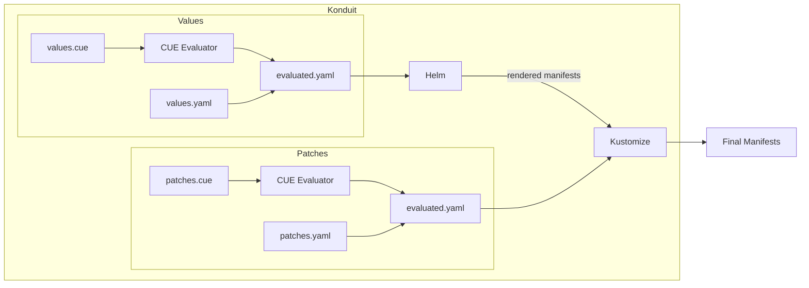

[![ci-badge]][ci-workflow]
[![release-badge]][release-workflow]
[![godoc-badge]][godoc]

[ci-badge]: https://github.com/jace-ys/konduit/workflows/ci/badge.svg
[ci-workflow]: https://github.com/jace-ys/konduit/actions?query=workflow%3Aci
[release-badge]: https://github.com/jace-ys/konduit/workflows/release/badge.svg
[release-workflow]: https://github.com/jace-ys/konduit/actions?query=workflow%3Arelease
[godoc-badge]: https://pkg.go.dev/badge/github.com/jace-ys/konduit/pkg/konduit.svg
[godoc]: https://pkg.go.dev/github.com/jace-ys/konduit/pkg/konduit

Helm meets Kustomize, but without the YAML.

# Konduit

Konduit is a thin wrapper around Helm that pre-evaluates chart values using more powerful configuration languages like [CUE](https://cuelang.org/) before passing them to Helm. This lets you build reusable configuration, enforce validation and constraints, and leverage the expressiveness that plain YAML can't provide. Since Konduit passes all arguments directly to Helm, it works seamlessly as a drop-in replacement or as a [Helm plugin](https://helm.sh/docs/topics/plugins/).

Konduit also includes built-in support for [Kustomize](https://kustomize.io/) as a Helm [post-renderer](https://helm.sh/docs/v3/topics/advanced/#post-rendering), allowing you to extend charts that don't expose the values or templates you need without forking them. In Konduit's context, "patches" refer to [kustomization](https://kubectl.docs.kubernetes.io/references/kustomize/kustomization/) files containing [built-in generators or transformers](https://kubectl.docs.kubernetes.io/references/kustomize/builtins/).

## Motivation

Helm charts work well as a packaging tool and still remain the industry standard for distributing Kubernetes applications, but managing chart values across many environments and services at scale comes with its own pain points:

- Plain YAML lacks type safety, validation, and the ability to reuse values across files
- If charts don't expose the right values or templates, consumers are stuck forking them
- Helm [lacks support for merging list values](https://github.com/helm/helm/issues/3486), a limitation for managing any reasonably sized deployment

You can find various related issues on the Helm repository, but essentially Helm isn't currently equipped to address these challenges for managing configuration at scale.

Konduit aims to address these by combining Helm with CUE and Kustomize. It doesn't seek to replace Helm, but enhance how charts are consumed. At its core, Konduit is a thin orchestration layer that can be expressed as:

```
cue export values.cue --out yaml | helm template -f - --post-renderer kustomize
```

### Alternatives

- Kustomize can inflate Helm charts natively, but lacks full Helm support such as private registries and plugins
- [Timoni](https://timoni.sh/) offers a CUE-native approach but requires rewriting charts as Timoni modules, a significant undertaking when you want to consume existing Helm charts as-is
  - *Disclaimer: Timoni has Helm interoperability but as far as I'm aware that currently only works with FluxCD*

## Features

- **CUE evaluation** — Pre-evaluate Helm values and Kustomize patches
  - Type safety, validation, and constraint enforcement
  - DRY configuration with expressions and defined relationships
  - Reusable modules importable by both values and patches

- **Injected scopes** — Inject external data into the CUE evaluation
  - Pass environment-specific configuration or secrets
  - Merge multiple scopes from files or inline JSON/YAML

- **Kustomize post-renderer** — Extend charts beyond what values expose
  - Leverage Kustomize built-in generators and transformers
  - Patches also benefit from CUE evaluation and injected scopes

- **Helm compatibility** — Drop-in replacement for the Helm CLI
  - Shells out to Helm, supporting all commands and plugins
  - Supports CUE and YAML files, with the latter taking precedence
  - Compatible with other post-renderers and plugins like [`helm-secrets`](https://github.com/jkroepke/helm-secrets)

## Overview



## Installation

```shell
# Homebrew
brew install jace-ys/tap/konduit

# Helm plugin
helm plugin install https://github.com/jace-ys/konduit

# Docker
docker pull ghcr.io/jace-ys/konduit:latest
```

See the [releases page](https://github.com/jace-ys/konduit/releases) for precompiled binaries.

## Usage

See the [complete documentation](docs/README.md) for how to use Konduit.

## Roadmap

- [ ] **Helm 4 support** — implement Konduit as a Helm 4 plugin ([HIP-0026](https://github.com/helm/community/blob/main/hips/hip-0026.md))
- [ ] **Extra manifests** — allow adding CUE manifests via Kustomize `resources`
- [ ] **Timoni support** — support Timoni as an alternative engine instead of Helm
- [ ] **Other evaluators** — add evaluator support for [Jsonnet](https://jsonnet.org/), [Dhall](https://dhall-lang.org/), [PKL](https://pkl-lang.org/), and others